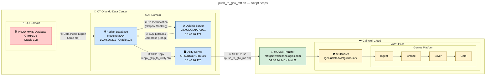

```mermaid
---
title: push_to_gtw_mft.sh — Script Steps
---
flowchart LR
    subgraph ODC["🏢 CT Orlando Data Center"]
        direction TB
        subgraph PROD_DOMAIN["PROD Domain"]
            PROD_DB["🗄️ PROD MMIS Database\nCTHP1DB\nOracle 10g"]
        end
        subgraph UAT_DOMAIN["UAT Domain"]
            direction TB
            REDACT_DB["🗄️ Redact Database\nctodclnora004\n10.40.26.211 · Oracle 19c"]
            DELPHIX["⚙️ Delphix Server\nCTXODCLNAPL001\n10.40.26.174"]
            UTILITY["🖥️ Utility Server\nCTXODCLNUTIL001\n10.40.26.175"]
        end
    end

    subgraph GW_CLOUD["☁️ Gainwell Cloud"]
        direction TB
        MOVEIT["📡 MOVEit Transfer\nmft.gainwelltechnologies.com\n54.80.94.146 · Port 22"]
        subgraph AWS["AWS East"]
            S3["🪣 S3 Bucket\n/genius/ctedw/stg/inbound/"]
            subgraph GENIUS["Genius Platform"]
                direction LR
                INGEST["Ingest"] --> BRONZE["Bronze"]
                BRONZE --> SILVER["Silver"]
                SILVER --> GOLD["Gold"]
            end
        end
    end

    PROD_DB -- "① Data Pump Export\n(.dmp file)" --> REDACT_DB
    REDACT_DB -- "② De-Identification\n(Delphix Masking)" --> DELPHIX
    DELPHIX -- "③ SQL Extract &\nCompress (.tar.gz)" --> REDACT_DB
    REDACT_DB -- "④ SCP Copy\n(copy_gzip_to_utility.sh)" --> UTILITY
    UTILITY -- "⑤ SFTP Push\n(push_to_gtw_mft.sh)" --> MOVEIT
    MOVEIT --> S3
    S3 --> INGEST

    classDef prodStyle fill:#ffcccc,stroke:#cc0000,color:#000
    classDef uatStyle fill:#cce5ff,stroke:#004085,color:#000
    classDef cloudStyle fill:#d4edda,stroke:#155724,color:#000
    classDef awsStyle fill:#fff3cd,stroke:#856404,color:#000

    class PROD_DB prodStyle
    class REDACT_DB,DELPHIX,UTILITY uatStyle
    class MOVEIT cloudStyle
    class S3,INGEST,BRONZE,SILVER,GOLD awsStyle

```