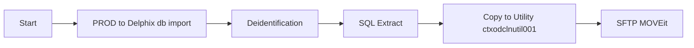
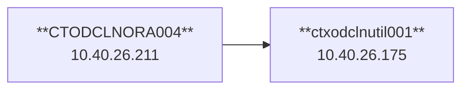

## Process

## Infra

## Contacts
| App | Contact |
| ----------- | ----------- |
| MOVEit | thughes39@gainwelltechnologies.com |
| Genius | chandrakanth.motlakunta@gainwelltechnologies.com |
| DeIdentification | poornima.dhanasekaran@gainwelltechnologies.com |

## Notes
### SFTP
- MOVEit does not like .gz, needs to be .tar.gz

### MOVEit
- To do automation need service user. SSH key tied to Gainwell login. Can't add Linux SSH Key in MOVEit per security 
- mft.gainwelltechnologies.com - **54.80.94.146**

### Scripts
tar

`tar -czf AIM_T_RE_DEATH_CHG_0.tar.gz AIM_T_RE_DEATH_CHG_0_test.dat`

## Tasks
- [x] Create scripts for copy
- [x] Create script for SFTP push
- [ ] Check on incremental refresh process 