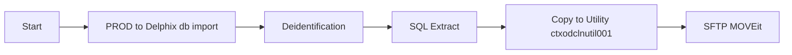
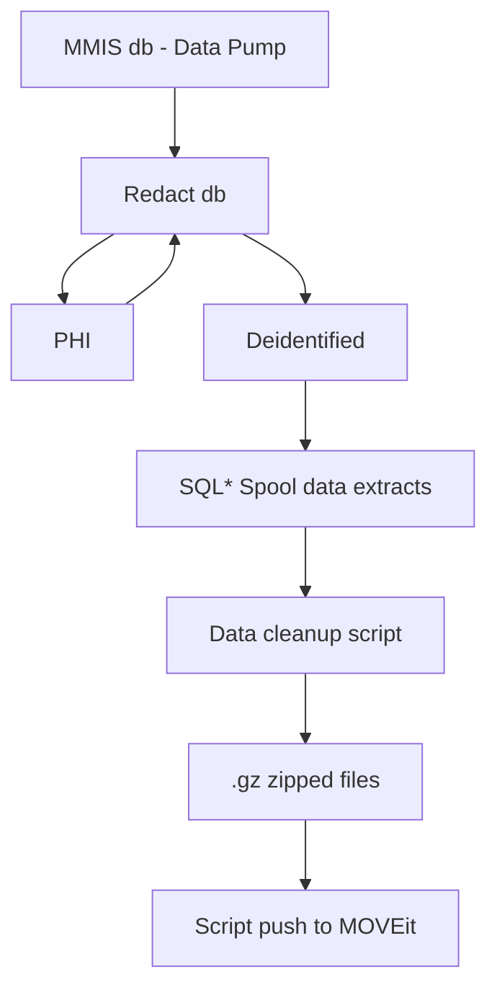
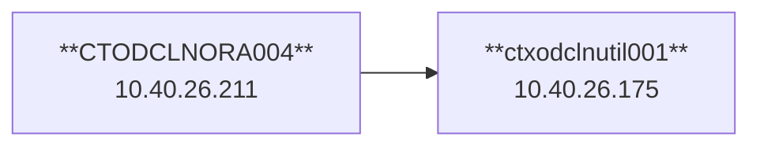

## Process

## Data

## Infra

*   GBs for .dat on db server
* 80 GBs used for .dat on Utility
* for .gz
* db schemas are AIM, AIM00, and AIM01

## Contacts
| App | Contact |
| ----------- | ----------- |
| MOVEit | thughes39@gainwelltechnologies.com |
| Genius | chandrakanth.motlakunta@gainwelltechnologies.com |
| Genius | dhananjay.godbole@gainwelltechnologies.com |
| DeIdentification | poornima.dhanasekaran@gainwelltechnologies.com |
| CT dba | hanh.nguyen@gainwelltechnologies.com |

## Server Access
- **CTODCLNORA004 - 10.26.40.175**

## Delphix
- Communicates using 1521 to Oracle SQL (default Oracle port)
- Delphix GUI is http://10.40.26.174/masking/login.do

## MOVEit
- To do automation need service user. SSH key tied to Gainwell login. Can't add Linux SSH Key in MOVEit per security 
- [mft.gainwelltechnologies.com](mft.gainwelltechnologies.com) - **54.80.94.146**
   - Use Gainwell ID (gt114477)
- Job picks up from /inbound/ folder regularly. Any files not picked up are likely bad
- SFTP on Ports 1521
- SNOW catalog items for credential access (asks for folder)
- Automation requires service account in Gainwell AD

## Scripts
**tar - Zips and compress files** `tar -czf AIM_T_RE_DEATH_CHG_0.tar.gz AIM_T_RE_DEATH_CHG_0_test.dat`
Time to run compression: ~Start: 12:30 EST  Finish: 2026-02-26 13:42:38 (EST)
Time to push to SFTP: Start: 2026-02-26 13:42:38 EST - 15:30:48 = ~2 hrs

## Issues / Lessons Learned
- Genius prefers .gz over .tar.gz (tar requires pre-code on Genius side). GZ built out of the box
- Delphix url is http://10.40.26.174/masking/login.do
- Issue with Delphix --> database connecticity was because use of Basic Connection string and not Advanced
- Several data issues on extract include extra carriage returns, leading and trailing spaces etc
- Run extract script from db server directly to save time
- PuTTY to log onto Linux server
- Linux uses local accounts
- WinSCP for FTP

## Tasks
- [x] Create scripts for copy
- [x] Create script for SFTP push
- [ ] Check on incremental refresh process 
- [ ] Get sizing of data on db server and on utility server
- [] Batching of ~files?
- [] Prompt for directory (hardcode /delphix/de-identified/)